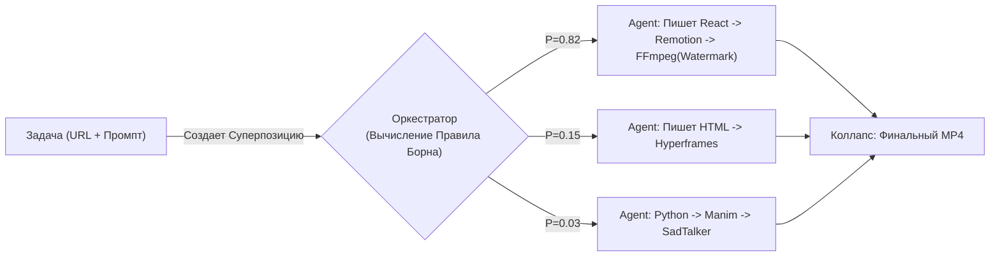

# 🌌 Квантовая Архитектура Video Factory

## 1. Жесткая Самокритика (От «Классики» к «Кванту»)

На текущий момент наш продукт строится по законам **классической ньютоновской механики**:
*   **Детерминированность:** Мы заставляем пользователя (или жесткую логику) выбирать конкретный движок (FFmpeg, Remotion, Manim) через UI. Один вход = один жестко заданный выход.
*   **Проблема бесконечности:** Если у нас появится 100 инструментов генерации и 10,000 референсов, наш `switch/case` в бэкенде взорвется. Мы не сможем управлять бесконечностью через линейные алгоритмы.
*   **Отсутствие гибкости:** Инструменты существуют в изоляции (silos). Они не могут спонтанно комбинироваться (например, 3D-сцена Manim внутри HTML-рамки HyperFrames, пропущенная через FFmpeg-фильтр).

**Вердикт:** Текущий подход (с жесткими адаптерами и селекторами) слишком линеен. Нам нужен "квантовый" переход, где оркестрация происходит не путем жесткого программирования шагов, а путем коллапса вероятностей на основе контекста.

---

## 2. Квантовая Модель Генерации (Теоретическая база)

Чтобы справиться с бесконечным количеством инструментов (базисными векторами) и референсов, мы переводим архитектуру на язык квантовой механики.

### Волновые функции видео (Волновая функция $\Psi$)
В любой момент времени до финального рендера видео не существует в конкретном виде. Оно является **суперпозицией** (волновой функцией $\Psi$) всех возможных комбинаций инструментов, ассетов и стилей.

$$ |\Psi\rangle = \sum_{i=1}^{\infty} c_i |E_i\rangle \otimes |S_i\rangle \otimes |A_i\rangle $$

Где:
*   $|E_i\rangle$ — базисное состояние движка (Remotion, Manim, LTX-2.3, AI-Agents...)
*   $|S_i\rangle$ — состояние стиля/референса (Luxury, TikTok, Documentary...)
*   $|A_i\rangle$ — набор входных данных (URL, Фото, Аудио)
*   $c_i$ — комплексная амплитуда вероятности того, что этот конкретный путь идеален.

### Уравнение Шрёдингера (Эволюция во времени)
Процесс генерации — это эволюция волновой функции во времени, описываемая Гамильтонианом $\hat{H}$ (нашим Главным Агентом-Оркестратором):

$$ i\hbar \frac{\partial}{\partial t} |\Psi(t)\rangle = \hat{H} |\Psi(t)\rangle $$

**Гамильтониан (Оркестратор)** постоянно обновляет состояния (вероятности $c_i$) в зависимости от поступающих данных. 
*Появилась новая фотография квартиры?* Гамильтониан увеличивает амплитуду вероятности использования 3D-движка. 
*Текст описания короткий и дерзкий?* Возрастает вероятность использования динамичного шаблона HyperFrames и агрессивной музыки.

### Правило Борна (Коллапс волновой функции)
Как из бесконечного числа вариантов получить один MP4-файл? Через наблюдение (финализацию решения).
Вероятность того, что ИИ выберет конкретную комбинацию $k$ (конкретный скрипт и набор инструментов), определяется правилом Борна:

$$ P_k = |\langle k | \Psi \rangle|^2 $$

**Что это значит для нашего кода:** Наш AI-Оркестратор (встроенный в Open-Harness) не должен использовать жесткие правила (rules engine). Он должен назначать *веса (вероятности)* каждому доступному инструменту на основе семантических эмбеддингов. Векторное расстояние (dot product) между задачей пользователя и метаданными инструмента определяет амплитуду вероятности. В момент "рендера" происходит вероятностная выборка (sampling) — волновая функция коллапсирует в конкретный DAG (Directed Acyclic Graph) исполнения.

---

## 3. Практическая реализация: «Бесконечная Фабрика»

Как переписать систему, чтобы она поглощала бесконечность новых репозиториев и тулзов?

### Шаг 1: Инструменты как Квантовые Состояния (Vector Plugin Registry)
Каждый новый инструмент (например, новый репозиторий с GitHub) больше не интегрируется через написание нового адаптера вручную. Он регистрирует себя в векторной базе данных (Chroma/Milvus) как **оператор** с определенным семантическим описанием.
*   *Инструмент А:* "Преобразую данные в графики, анимация на Python, медленно, для умной аудитории" (Manim).
*   *Инструмент B:* "Рендерю HTML-код в видео с музыкой, быстро" (HyperFrames).
*   *Инструмент C:* "Удаляю водяные знаки, требует GPU" (toolkit).

### Шаг 2: Интерференция Агентов (Agent Swarm)
Вместо одного агента, который пишет скрипт, мы запускаем *рой суб-агентов* в состоянии квантовой запутанности. Каждый агент тянет одеяло на себя:
1.  Агент-Дизайнер предлагает сгенерировать 3D.
2.  Агент-Маркетолог предлагает 2D-слайдшоу для Reels.
3.  Они **интерферируют**. Если у нас нет GPU (ограничение среды, измерение), волна 3D гасится (деструктивная интерференция). Волна 2D-слайдшоу усиливается (конструктивная интерференция). Система самобалансируется.

### Шаг 3: Динамический Граф Рендеринга (Матрица Плотности)
Вместо того чтобы в дашборде выбирать "Remotion", система на лету строит граф вероятностей и коллапсирует его:

## 4. Решение Задачи: Как поглотить бесконечность?
Чтобы "Video Factory" мог делать бесконечное количество видео из бесконечного количества инструментов:

1. **Убираем селекторы из UI.** Пользователь больше не должен выбирать движок. Он вводит *намерение* ("Продай эту квартиру богато").
2. **Внедряем RAG для инструментов.** Каждый инструмент (Remotion, Manim, FFmpeg команды) описывается текстом и векторизуется.
3. **Agent-as-a-Compiler.** Когда поступает задача, Главный Агент делает семантический поиск по векторной базе инструментов (считает "амплитуды вероятности"). Выбирает топ-N подходящих инструментов.
4. **LLM пишет связующий код (Adapter-on-the-fly).** Агент динамически генерирует скрипт (Python/Bash/JS), который связывает эти выбранные инструменты в конвейер для *конкретно этого видео*. После рендера этот временный скрипт уничтожается (состояние схлопывается).

Только перейдя от детерминированных конвейеров к вероятностной сборке пайплайнов (квантовому подходу), наша архитектура сможет переварить 10,000+ GitHub-репозиториев, не требуя переписывания ядра. Мы должны строить не фабрику, а **среду, в которой фабрики зарождаются сами в момент запроса**.
