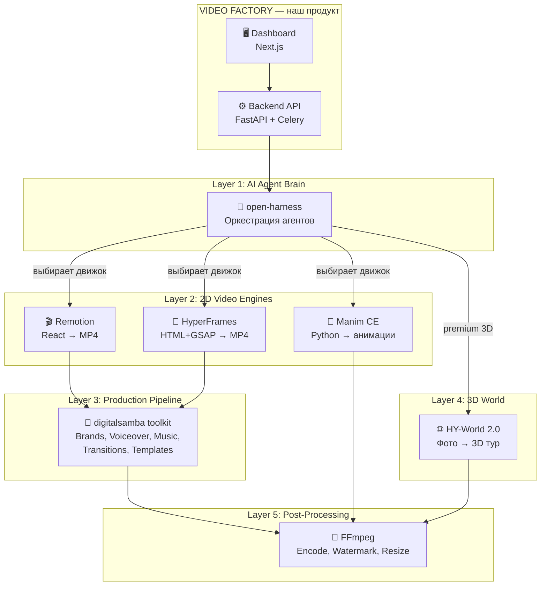

# 🏗️ Video Factory — Полная модульная архитектура (v2)

## 📊 Полный реестр: 8 репозиториев

| # | Репозиторий | Что делает | Язык | ⭐ | Лицензия |
|---|------------|-----------|------|-----|----------|
| 1 | **[HyperFrames](https://github.com/heygen-com/hyperframes)** | HTML + GSAP → MP4 (HeyGen) | TS | 10.2k | Apache 2.0 ✅ |
| 2 | **[Remotion](https://github.com/remotion-dev/remotion)** | React компоненты → MP4 | TS | 21k+ | Custom (source-available) ⚠️ |
| 3 | **[digitalsamba toolkit](https://github.com/digitalsamba/claude-code-video-toolkit)** | Полный pipeline: Remotion + AI voiceover + музыка + brand system | TS/Python | 957 | MIT ✅ |
| 4 | **[Manim CE](https://github.com/ManimCommunity/manim)** | Python → математические/анимированные видео (стиль 3Blue1Brown) | Python | 25k+ | MIT ✅ |
| 5 | **[ReFrameMotion](https://github.com/homgorn/reframemotion)** | Форк HyperFrames с REST API, русская локализация | TS/HTML | 0 | Apache 2.0 ✅ |
| 6 | **[Open-Harness](https://github.com/MaxGfeller/open-harness)** | SDK для AI-агентов (оркестрация, сессии, middleware) | TS | 482 | MIT ✅ |
| 7 | **[HY-World 2.0](https://github.com/homgorn/HY-World-2.0-Generating-and-Simulating-3D-Worlds)** | Фото/текст → 3D мир (Gaussian Splatting, Tencent) | Python | 1 | Tencent |
| 8 | **[Claude-Code-Video-Toolkit](https://github.com/wilwaldon/Claude-Code-Video-Toolkit)** | Каталог-справочник паттернов (Remotion, Manim, FFmpeg, YouTube) | MD | 21 | MIT ✅ |

---

## 🔗 Архитектура: 5 слоёв движка



---

## 🧩 Детальный разбор каждого модуля

### 🎬 Remotion (`remotion-dev/remotion`) — Ключевой движок

**Что:** React-фреймворк для программного создания видео. Пишешь React компоненты → рендеришь MP4.

**Ключевые возможности для нас:**
- `useCurrentFrame()`, `interpolate()`, `spring()` — анимации
- `<Sequence>`, `<Composition>` — таймлайн и сцены
- Remotion Studio — live preview в браузере
- `npx remotion render` — рендер в MP4
- Поддержка AI-агентов (`npx skills add remotion`)

**Применение в Video Factory:**
- Основной движок для marketing/product видео недвижимости
- Ken Burns эффект на фотографиях
- Текстовые оверлеи (цена, адрес, площадь)
- Branded intros/outros

> [!WARNING]
> **Лицензия Remotion** — source-available, НЕ OSI open-source. Для компаний >3 человек нужна платная лицензия ($250/год Company). Для MVP и personal use — бесплатно. Если лицензия критична — используем HyperFrames (Apache 2.0) как альтернативу.

---

### 🎥 digitalsamba toolkit — Production Pipeline

**Что:** Полный production workspace поверх Remotion. 957 ⭐, 157 commits, MIT лицензия.

**Что внутри (очень много полезного!):**
- **11 reusable components** — titles, callouts, lower thirds, stats
- **7 кастомных transitions** + 4 от Remotion (glitch, rgbSplit, zoomBlur, lightLeak, pixelate, clockWipe, checkerboard)
- **Brand system** — `brands/my-brand/brand.json` (цвета, шрифты, лого)
- **AI Voiceover** — Qwen3-TTS (бесплатный self-hosted) + ElevenLabs
- **AI Music** — ACE-Step (бесплатный) + ElevenLabs
- **AI Image Gen** — FLUX.2 (text-to-image)
- **AI Video Gen** — LTX-2.3 (text-to-video + image-to-video!)
- **SadTalker** — talking head из фото + аудио
- **Image upscaling** — Real-ESRGAN (то что у нас в roadmap!)
- **Project lifecycle** — planning → assets → review → audio → editing → rendering → complete
- **Cloud GPU** — Modal ($30/мес бесплатно) или RunPod

**Применение:** Это практически ГОТОВЫЙ бэкенд для нашего Video Factory! Нам нужно только парсер + dashboard.

---

### 📐 Manim CE — Анимированная инфографика

**Что:** Python фреймворк для математических/инфографических анимаций (стиль 3Blue1Brown). MIT лицензия.

**Применение в Video Factory:**
- Анимированные графики цен/статистики
- Визуализация планировок (2D → анимированный обход)
- Стильные текстовые анимации для premium вариантов
- Обучающие/презентационные видео для агентств

---

### 📄 HyperFrames — Альтернативный движок (Apache 2.0)

**Что:** HTML + data-attributes + GSAP → MP4. Бесплатный аналог Remotion от HeyGen.

**Преимущества:**
- Apache 2.0 (полностью свободная лицензия)
- AI-first (agents already speak HTML)
- 50+ каталожных блоков (social overlays, shader transitions, charts)
- MCP server для AI-агентов

**Когда использовать:** Если лицензия Remotion не подходит, или для быстрых простых видео.

---

## 🛡️ Стратегия Upstream Sync (обновлённая)

### Файловая структура

```
video-factory/
├── vendor/                           ← Git Submodules
│   ├── remotion/                     ← remotion-dev/remotion
│   ├── hyperframes/                  ← heygen-com/hyperframes  
│   ├── digitalsamba-toolkit/         ← digitalsamba/claude-code-video-toolkit
│   ├── manim/                        ← ManimCommunity/manim
│   ├── open-harness/                 ← MaxGfeller/open-harness
│   ├── hy-world-2.0/                ← Tencent HY-World
│   └── reframemotion/                ← homgorn/reframemotion
│
├── adapters/                         ← Наш изоляционный слой
│   ├── __init__.py
│   ├── remotion_adapter.py           ← Remotion: generate composition → render MP4
│   ├── hyperframes_adapter.py        ← HyperFrames: HTML → MP4
│   ├── manim_adapter.py              ← Manim: Python scene → MP4
│   ├── digitalsamba_adapter.py       ← Toolkit: voiceover, music, brand, transitions
│   ├── world3d_adapter.py            ← HY-World: photos → 3D → video
│   ├── agent_adapter.py              ← Open-Harness: AI orchestration
│   └── ffmpeg_adapter.py             ← FFmpeg: post-processing
│
├── backend/                          ← FastAPI (imports ONLY from adapters/)
├── frontend/                         ← Next.js Dashboard
└── tests/adapter_compat/             ← Compatibility tests
```

### Процесс безопасного обновления

```bash
# 1. Обновить конкретный submodule
cd vendor/remotion && git fetch && git checkout v5.1.0

# 2. Запустить тесты совместимости
cd ../.. && pytest tests/adapter_compat/test_remotion.py

# 3. Если тесты красные → обновить адаптер
# 4. Если зелёные → git add vendor/remotion && git commit
```

---

## 📋 Execution Plan (SpecKit)

### Phase A: Foundation ✅ (частично готово)
- [x] Backend persistence (SQLAlchemy)
- [x] Frontend init (Next.js 14)
- [ ] Git submodules setup (все 7 repos)
- [ ] Adapter layer scaffold

### Phase B: MVP Video Engine
- [ ] **Remotion adapter** — React composition generator для недвижимости
- [ ] **digitalsamba integration** — brand system + transitions
- [ ] **FFmpeg adapter** — watermark, resize, encode
- [ ] **CIAN парсер** (реальный)
- [ ] **Dashboard UI** — premium дизайн

### Phase C: Extended Engines
- [ ] **HyperFrames adapter** — альтернативный движок
- [ ] **Manim adapter** — инфографика, графики цен
- [ ] **AI Voiceover** — Qwen3-TTS через digitalsamba tools
- [ ] **AI Music** — ACE-Step через digitalsamba tools

### Phase D: Premium Features
- [ ] **HY-World 2.0** — 3D туры (требует GPU)
- [ ] **Open-Harness** — AI-агент выбирает лучший движок
- [ ] **LTX-2.3** — AI video generation (text/image→video)

---

## ⚠️ Open Questions

> [!IMPORTANT]
> 1. **Лицензия Remotion** — готовы ли платить $250/год? Или использовать HyperFrames (бесплатно) как основной, а Remotion как опциональный?
> 2. **GPU для HY-World 2.0** — есть ли доступ к NVIDIA GPU (24GB+ VRAM)? Или использовать Colab/Modal?
> 3. **digitalsamba toolkit** — использовать целиком как основу, или только отдельные tools (voiceover, music)?

---

## ✅ Verification Plan

### Automated
- `npx remotion render` — тест рендера Remotion
- `npx hyperframes render` — тест рендера HyperFrames  
- `manim render Scene` — тест рендера Manim
- `pytest tests/adapter_compat/` — все адаптеры работают
- `docker-compose up` — весь стек поднимается

### Manual
- Dashboard `localhost:3000` — создание задачи → видео генерируется
- Brand profile применяется (цвета, лого, шрифты)
- Voiceover генерируется на русском языке
