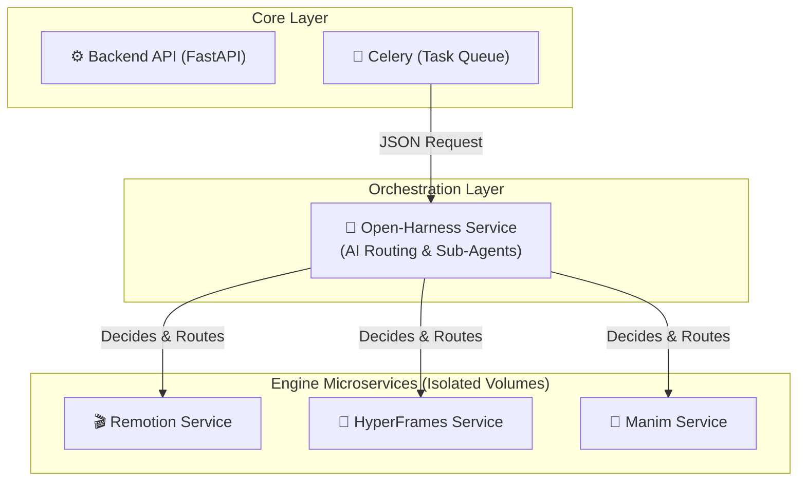

# 🏗️ Video Factory — Production-Ready Architecture (v3)

## 📊 Стратегия "В Прод Сразу"

Основываясь на результатах архитектурной критики, мы отказываемся от локального запуска всех движков в одном раздутом Celery-воркере. Наша цель — **надежный, отказоустойчивый Production**. Остальные движки идут в Roadmap как отдельные микросервисы.

---

## 🔗 Новая Микросервисная Архитектура

Вместо монолита, `docker-compose.yml` будет оркестрировать изолированные сервисы. Каждый движок живет в своей песочнице со своими зависимостями (Node, Python).

---

## 🛡️ Безопасное обновление (Upstream Sync)
Важное архитектурное решение: мы **не меняем** код внутри папок `vendor/`.
Наши микросервисы (Express-серверы, Python-адаптеры) лежат в директории `engines/` и подключают папки из `vendor/` как внешние тома (Volumes) или зависимости. 
Это значит, что когда вы сделаете `git submodule update --remote vendor/hyperframes`, наш продукт не сломается, а просто подтянет новые фичи.

---

## 📋 Execution Plan (Дорожная Карта до Прода)

### Phase B: Prod-Ready Foundation (Завершено)
- [x] Docker-compose + Remotion Service + Worker refactor.

### Phase C: Engine Expansion & Orchestration (Текущая фаза)
- [NEW] `engines/open-harness/Dockerfile` — сервис-роутер на базе TS, который использует сабмодуль `vendor/open-harness` для принятия решений ИИ-Агентами.
- [NEW] `engines/hyperframes/Dockerfile` — (Bun, Node) микросервис для HyperFrames.
- [NEW] `engines/manim/Dockerfile` — (Python 3.11, Cairo) микросервис для Manim.

### Phase D: Production Hardening (Security, Logging, Observability) 🔒
Для того чтобы система выжила в реальном продакшене, нам жизненно необходимы следующие модули:

#### 1. Централизованное Логирование (Grafana Loki)
Сейчас логи разбросаны по 7 контейнерам. Если видео упало на этапе `Celery -> Open-Harness -> Remotion`, найти концы невозможно.
- **Решение:** Подключить **Loki + Promtail + Grafana**. Все контейнеры отправляют логи в одну точку. Мы сможем искать ошибки по `job_id` сквозь все микросервисы.

#### 2. Безопасность и Изоляция Сети (Network Security)
Прямо сейчас порты микросервисов (`8001`, `8002`, `8003`) "торчат" наружу в `docker-compose.yml`. Это брешь — кто угодно может послать запрос напрямую в движок в обход биллинга.
- **Решение:** Убрать директиву `ports:` у всех `engines/*`. Они должны общаться только по внутренней сети Docker (`internal_net`), доступ к ним должен иметь только Celery-воркер.

#### 3. Аутентификация и Rate-Limiting (API Gateway)
FastAPI открыт всему интернету. Злоумышленник может запустить цикл и положить наши GPU/CPU бесплатными запросами.
- **Решение:** Добавить JWT-авторизацию или API-ключи. Внедрить **Rate Limiter** на базе Redis (например, макс. 5 видео в час для бесплатных аккаунтов).

#### 4. Жизненный цикл данных (Storage Lifecycle)
Генерация тысяч MP4 файлов быстро забьет диск.
- **Решение:** Настроить MinIO Lifecycle Policies (автоматическое удаление видео старше 30 дней) или подключить внешний S3 (AWS/Yandex Cloud) с настроенным TTL.

#### 5. Webhooks / WebSockets (Real-time UX)
Заставлять Frontend постоянно "дергать" API (`GET /status` каждые 5 сек) — плохой тон.
- **Решение:** Внедрить WebSockets в FastAPI (или Webhooks), чтобы сервер сам "пушил" уведомление в React, когда видео срендерилось.

#### 6. Трассировка (Trace ID), Sentry и Автотесты (QA Pipeline)
Автотесты и дебаггинг должны работать в симбиозе с логами. Как это сделать правильно:
- **Trace ID (Сквозной ID):** Каждому запросу при входе в FastAPI присваивается уникальный `trace_id` (обычно это `job_id`). Этот ID пробрасывается во *все* микросервисы. Если рендер упадет в контейнере `remotion`, мы в Grafana пишем `trace_id="123"` и видим всю цепочку: парсер -> celery -> open-harness -> remotion.
- **Структурированные логи (JSON):** Все микросервисы пишут логи только в формате JSON, чтобы системы (Loki/ELK) могли их легко парсить.
- **Sentry:** Автоматический отлов unhandled exceptions (необработанных ошибок). Sentry покажет точную строчку кода, где упал Python или Node.js, и свяжет ее с `trace_id`.
- **Умные Автотесты (Pytest):** Если E2E-тест (End-to-End) падает в CI/CD (например, видео не сгенерировалось за 2 минуты), тестовый фреймворк автоматически делает запрос в систему логов по этому `trace_id` и **прикрепляет логи всех микросервисов к отчету об ошибке теста** (Allure Report). Разработчику не нужно лезть на сервер.

### Phase E: Product & Business Logic (The Missing Pieces) 🧩
Мы построили крутой технический движок, но для коммерческого продукта мы упустили несколько подводных камней:

#### 1. Кэширование и Идемпотентность (Idempotency)
Если Агент А вставил ссылку на квартиру, а через час Агент Б вставил **ту же самую ссылку**, система начнет рендерить видео заново, сжигая CPU. 
- **Фикс:** Кэширование. Бэкенд должен проверять хэш ссылки. Если видео по этой ссылке уже было сгенерировано (и данные не изменились), мы отдаем готовый MP4 за 0.1 секунду.

#### 2. Охотник за Зомби (Dead Jobs Reaper)
Что если во время 10-минутного рендера сервер моргнул, или контейнер Remotion перезагрузился по нехватке памяти (OOM)? Задача в базе навсегда останется в статусе `PROCESSING`. Frontend будет крутить лоадер бесконечно.
- **Фикс:** Celery Beat Cron Job. Раз в 5 минут ищем задачи со статусом `PROCESSING`, которые висят дольше 15 минут, и принудительно переводим их в `FAILED`.

#### 3. Форматы (9:16 vs 16:9)
Риелторам редко нужно одно видео. Им нужен вертикальный Shorts/Reels (9:16) и горизонтальный для Web (16:9).
- **Фикс:** В пайплайн нужно заложить параметр `aspect_ratio`. Движки (Remotion/Hyperframes) должны уметь адаптивно рендерить оба формата из одного набора данных.

#### 4. Копирайт на Аудио и TTS
Видео недвижимости без музыки — мертвое. Если мы будем брать случайные MP3, YouTube/TikTok заблокирует видео за нарушение АП (копирайт-страйк). Голос (TTS) от ElevenLabs стоит очень дорого.
- **Фикс:** Интеграция с Royalty-Free библиотекой музыки (или 100 своих треков) + Локальный бесплатный TTS (например, Qwen-Audio или Silero) для экономии.

#### 5. Модерация Контента (NSFW)
Если кто-то вставит ссылку на порносайт, парсер скачает фото, ИИ напишет скрипт, а наши сервера сгенерируют запрещенное видео. 
- **Фикс:** Подключить легковесный NSFW-классификатор сразу после этапа парсинга, чтобы блокировать токсичные ссылки.

#### 6. Водяные знаки (Watermarks)
Для бесплатных пользователей на готовое видео должен накладываться водяной знак "Made with Video Factory". Это виральность. Платные пользователи должны иметь возможность загрузить свой `.png` логотип (Brand Kit).

### Phase F: Ultimate SaaS Scaling & Edge Cases 🚀
Если копать на уровень "Единорога" (Unicorn SaaS), мы упустили еще более глубокие вещи:

#### 1. Динамические Субтитры (A11y)
85% видео в Instagram Reels / TikTok смотрят **без звука**. Видео без крупных красивых субтитров — мертвое видео. Нам нужна транскрипция сгенерированного голоса (Whisper) и автоматическое "вшивание" субтитров (SRT/VTT) поверх кадров (как у Alex Hormozi).

#### 2. Проблема Шрифтов и Локализации (i18n)
Если клиент вставит ссылку на недвижимость из ОАЭ (арабский) или Японии, а в нашем Docker-контейнере Remotion нет нужных `.ttf` шрифтов, на видео отрендерятся "квадратики" `[][][]`. Нужен надежный механизм загрузки мультиязычных шрифтов и поддержки RTL (Right-to-Left) текста.

#### 3. Эластичное Автомасштабирование (KEDA)
Рендеринг видео — это "взрывная" (bursty) нагрузка. Если маркетинговое агентство загрузит Excel-файл на 500 ссылок, наш фиксированный `docker-compose` будет рендерить их двое суток подряд на одном процессоре. Нам нужен Kubernetes (KEDA), который увидит очередь из 500 задач в Celery, мгновенно арендует 50 серверов в облаке, отрендерит все за 10 минут, и удалит сервера (Scale-to-Zero), чтобы не платить за простой.

#### 4. Защита Трафика (CDN & Signed URLs)
Раздавать 50-мегабайтные MP4 напрямую из нашего MinIO = разориться на трафике. Нам нужен CDN (Cloudflare) перед хранилищем. Кроме того, видео должны отдаваться по Signed URLs (временным ссылкам), чтобы конкуренты не могли встроить (hotlink) наши видео на свои сайты за наш счет.

#### 5. ИИ Заполнитель (B-Roll & Outpainting)
Что если парсер найдет на сайте всего 1 фотографию? 30-секундное видео из 1 фото — это скука. Нам нужен ИИ-модуль, который генерирует B-Roll (дополнительные стоковые видео) по тексту описания или использует AI Outpainting для расширения 1 фотографии в разные ракурсы.

---

## User Review Required

> [!WARNING]
> **Переход к Финальным Фичам:**
> Как видите, путь от "Технической Демки" до "Коммерческого SaaS" включает кэширование, обрезку форматов и защиту авторских прав (Фаза E), а также Субтитры, CDN и Автоскейлинг (Фаза F).
> Это абсолютный максимум, о котором стоит думать "на берегу". Хотите ли вы интегрировать что-то из Фаз E и F прямо сейчас, или зафиксируем этот план как эталонную архитектуру и перейдем к тестированию того, что уже написано?
